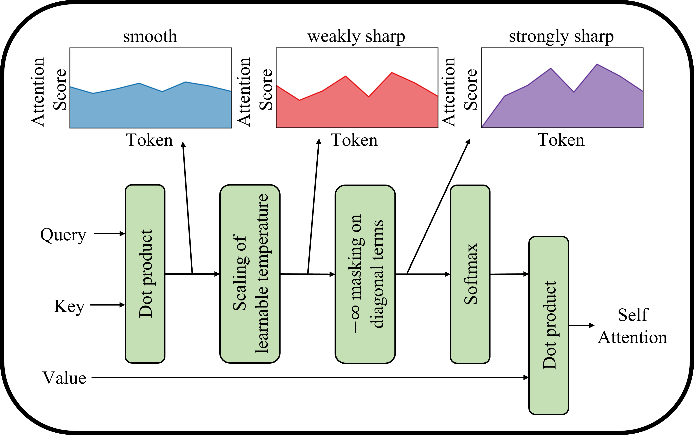
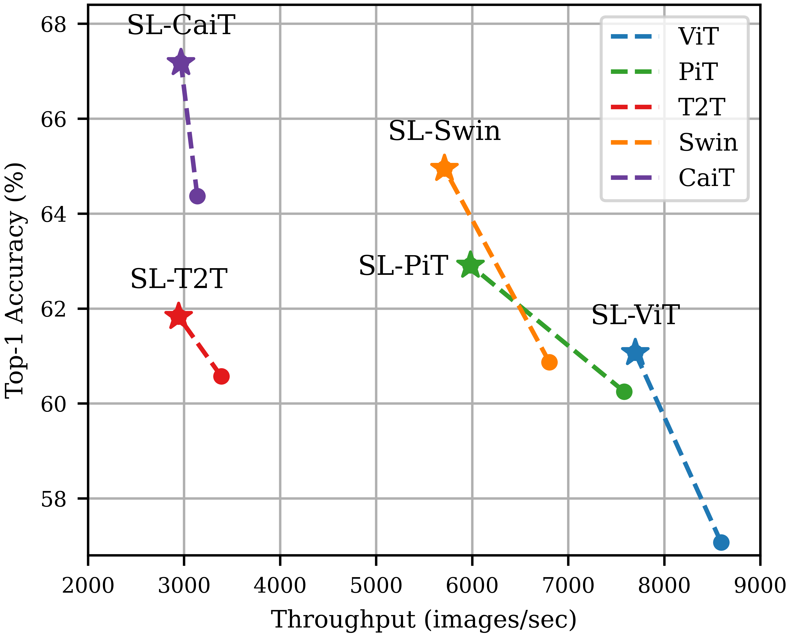

## Vision Transformer for Small-Size Datasets

**Seung Hoon Lee and Seunghyun Lee and Byung Cheol Song** | [Paper](https://arxiv.org/abs/2112.13492)

Inha University

### Abstract
Recently, the Vision Transformer (ViT), which applied the transformer structure to the image classification task, has outperformed convolutional neural networks. However, the high performance of the ViT results from pre-training using a large-size dataset such as JFT-300M, and its dependence on a large dataset is interpreted as due to low locality inductive bias. This paper proposes Shifted Patch Tokenization (SPT) and Locality Self-Attention (LSA), which effectively solve the lack of locality inductive bias and enable it to learn from scratch even on small-size datasets. Moreover, SPT and LSA are generic and effective add-on modules that are easily applicable to various ViTs. Experimental results show that when both SPT and LSA were applied to the ViTs, the performance improved by an average of 2.96% in Tiny-ImageNet, which is a representative small-size dataset. Especially, Swin Transformer achieved an overwhelming performance improvement of 4.08% thanks to the proposed SPT and LSA.

### Method
#### Shifted Patch Tokenization

<!-- <div align="center"> -->
  
<!-- </div> -->

#### Locality Self-Attention

<!-- <div align="center"> -->
  </img></img>
<!--   </div> -->

### Model Performance
#### Small-Size Dataset Classification
| Model      | FLOPs | CIFAR10 | CIFAR100 | SVHN |Tiny-ImageNet |
|-----------|---------:|--------:|:-----------------:|:-----------------:|:-----------------:|
|ViT    | 189.8  | 93.58  | 73.81 | 97.82 | 57.07 |
|SL-ViT | 199.2  | 94.53  | 76.92 | 97.79 | 61.07 |
|T2T    | 643.0  | 95.30  | 77.00 | 97.90 | 60.57 |
|SL-T2T | 671.4  | 95.57  | 77.36 | 97.91 | 61.83 |
|CaiT   | 613.8  | 94.91  | 76.89 | 98.13 | 64.37 |
|SL-CaiT| 623.3  | 95.81  | 80.32 | 98.28 | 67.18 |
|PiT    | 279.2  | 94.24  | 74.99 | 97.83 | 60.25 |
|SL-PiT | 322.9  | 95.88  | 79.00 | 97.93 | 62.91 |
|Swin   | 242.3  | 94.46  | 76.87 | 97.72 | 60.87 |
|SL-Swin| 284.9  | 95.93  | 79.99 | 97.92 | 64.95 |

#### Accuracy-Throughput Graph on Tiny-ImageNet

<!-- <div align="center"> -->
  </img>
<!-- </div> -->

## How to train models
### Pure ViT
```bash
python main.py --model vit 
```
### SL-Swin
```bash
python main.py --model swin --is_LSA --is_SPT 
```

## Citation

```
@article{lee2021vision,
  title={Vision Transformer for Small-Size Datasets},
  author={Lee, Seung Hoon and Lee, Seunghyun and Song, Byung Cheol},
  journal={arXiv preprint arXiv:2112.13492},
  year={2021}
}
```
